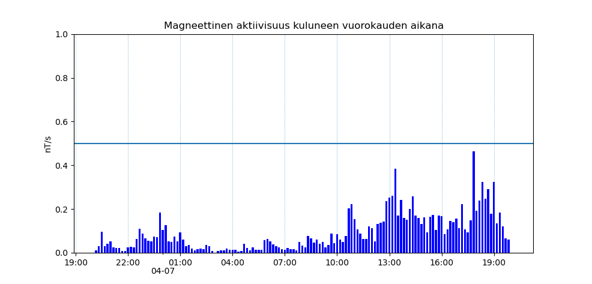

# Aurora

Short script to fetch magnetic activity data from ilmatieteenlaitos and graph it. Currently it graphs it exactly like it does on [revontulet ja avaruussää](https://www.ilmatieteenlaitos.fi/revontulet-ja-avaruussaa) page.

I just wanted to find out where to get this data so I can possibly use it in future project.

